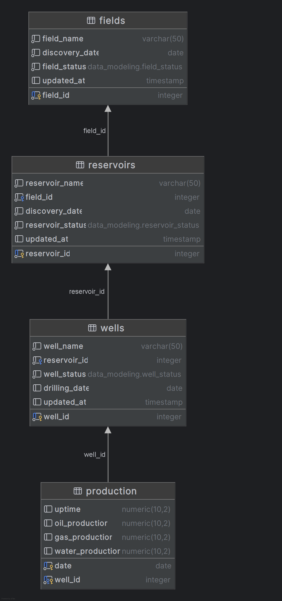
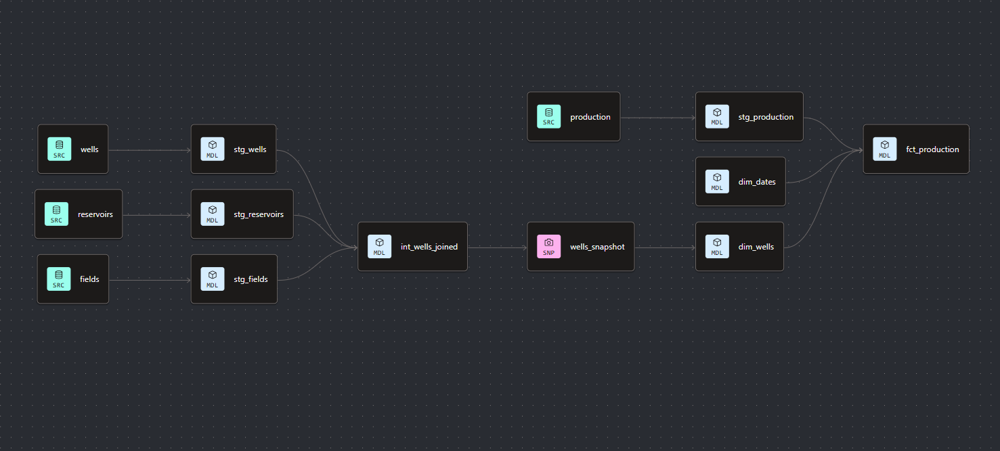

# Oil & Gas: End-to-End Data Modeling

I built this as a full pass through an oil and gas production domain: design a relational source schema, then build the analytics layer on BigQuery with dbt.

The idea is simple. Fields contain reservoirs, reservoirs contain wells, and wells produce oil, gas, and water every day. Statuses change over time (drilling → producing → shut-in, etc.), so the warehouse needs to track those changes properly, not just overwrite them.

## Articles

I wrote a 2-part write-up on this project:

- [Part 1: From Flat Files to Relational Models](https://blog.dataengineerthings.org/from-flat-files-to-relational-models-architecting-oil-gas-production-data-8c9c1e684408)
- [Part 2: From Relational Models to Dimensional Models](https://medium.com/@Oladayo/from-relational-models-to-dimension-models-architecting-oil-gas-production-data-26a9c780e686)

## What's in the folder

```
oltp/          # source schema (PostgreSQL DDL)
olap/          # dbt project on BigQuery
assets/        # ERD and dbt lineage diagrams
```

## Source model (OLTP)

The relational schema lives in `oltp/ddl.sql`. Four tables:

- **Fields**: the field itself and its lifecycle status
- **Reservoirs**: belong to a field
- **Wells**: belong to a reservoir
- **Production**: daily oil / gas / water volumes and uptime (hours) by well

Enums cover field, reservoir, and well statuses so the source stays constrained.



## Warehouse (OLAP)

The dbt project in `olap/` reads from BigQuery (`oil_and_gas_src`) and builds out staging → intermediate → marts.

**Staging**: light cleanup of fields, reservoirs, wells, and production.

**Intermediate**: `int_wells_joined` denormalizes well + reservoir + field into one row and picks the latest `updated_at` across all three. That timestamp drives the SCD snapshot.

**Snapshots**: `wells_snapshot` uses dbt's timestamp strategy so when a well (or its parent field/reservoir) changes, you get a new version instead of losing history.

**Marts**

| Model | Role |
| --- | --- |
| `dim_wells` | SCD Type 2 well dimension (with reservoir and field attributes baked in) |
| `dim_dates` | Calendar spine from 2019–2040 via `dbt_utils.date_spine` (standalone; BI tools join on `production_date_key`) |
| `fct_production` | Daily production facts with uptime, joined to the well version that was valid on that day |

Point-in-time joins matter here: production on a given date should attach to the well status as it was then, not whatever it is today.



## Tests

Sources and marts have the usual checks: uniqueness, not-null, relationships, and `dbt_utils.unique_combination_of_columns` on production (well + date).

## Tools

- PostgreSQL (source DDL)
- BigQuery
- dbt Core + `dbt_utils`
- Git
