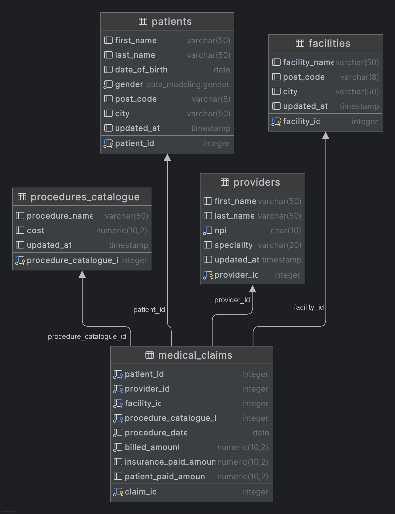
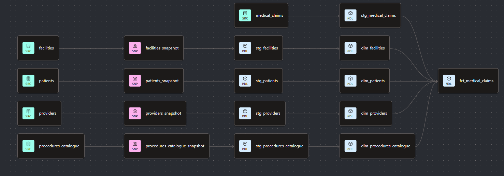

# Healthcare: End-to-End Data Modeling

I built this as a full pass through a healthcare claims domain: design a relational source schema, then build the analytics layer on BigQuery with dbt.

The idea is simple. Patients get procedures at facilities from providers. Each claim records who was treated, by whom, where, what procedure ran, and how the bill was split. Patient, provider, facility, and procedure attributes can change over time, so the warehouse needs to track those versions, not just overwrite them.

## Case study

This is a portfolio case study for MediClaim, a fictional regional hospital network. Admins were querying the operational database for financial reporting, which slowed down clinical workflows. The CFO needed a dedicated warehouse to answer:

- Which providers generate the most billed revenue?
- Which procedures are performed most often?
- How much is collected from insurance vs patient out-of-pocket payments?

## What's in the folder

```
oltp/          # source schema (PostgreSQL DDL)
olap/          # dbt project on BigQuery
assets/        # ERD and dbt lineage diagrams
```


## Source model (OLTP)

The relational schema lives in `oltp/ddl.sql`. Five tables:

- **Patients**: demographics and location
- **Providers**: name, NPI, and speciality
- **Facilities**: name and location
- **Procedures_Catalogue**: procedure name and cost
- **Medical_Claims**: one row per claim, with billed and paid amounts

A gender enum and check constraints keep the source constrained (amounts, NPI digits, payment balance).



## Warehouse (OLAP)

The dbt project in `olap/` reads from BigQuery (`healthcare_src`) and builds out snapshots → staging → marts.

**Snapshots**: timestamp strategy on patients, providers, facilities, and procedures catalogue so attribute changes keep history.

**Staging**: renames snapshot SCD columns into surrogate keys and validity windows; light cleanup on claims from the source.

**Marts**


| Model                      | Role                                                                                                           |
| -------------------------- | -------------------------------------------------------------------------------------------------------------- |
| `dim_patients`             | SCD Type 2 patient dimension                                                                                   |
| `dim_providers`            | SCD Type 2 provider dimension                                                                                  |
| `dim_facilities`           | SCD Type 2 facility dimension                                                                                  |
| `dim_procedures_catalogue` | SCD Type 2 procedure catalogue dimension                                                                       |
| `dim_dates`                | Calendar spine from 2015 onward via `dbt_utils.date_spine` (standalone; BI tools join on `procedure_date_key`) |
| `fct_medical_claims`       | Claim facts joined to the dimension versions valid on the procedure date                                       |


Point-in-time joins matter here: a claim on a given date should attach to patient, provider, facility, and procedure attributes as they were then, not whatever they are today.



## Tests

Sources have uniqueness, not-null, relationships, and accepted values on gender. Singular tests check claim amounts are not negative. Marts have uniqueness on surrogate keys, not-null checks, and relationships from claims to dimensions and `dim_dates`.

## Tools

- PostgreSQL (source DDL)
- BigQuery
- dbt Core + `dbt_utils`
- Git

